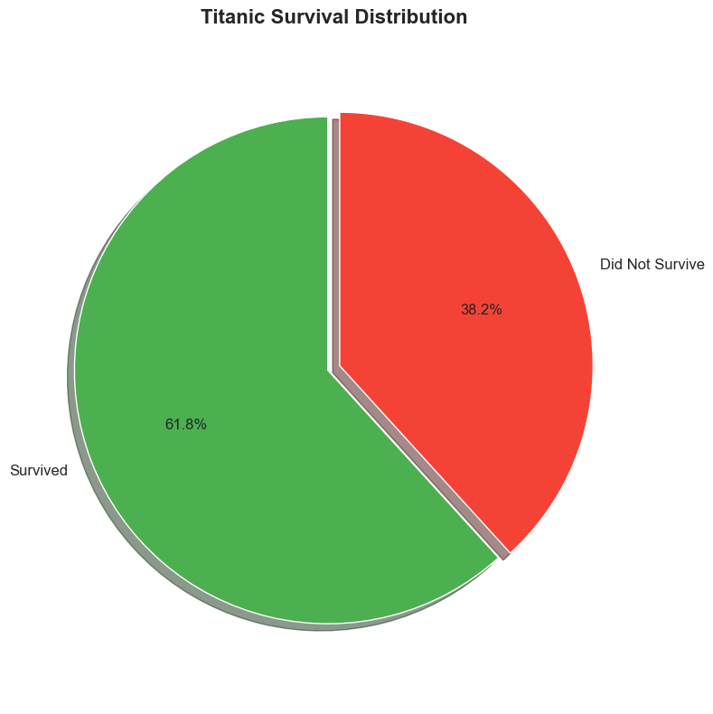
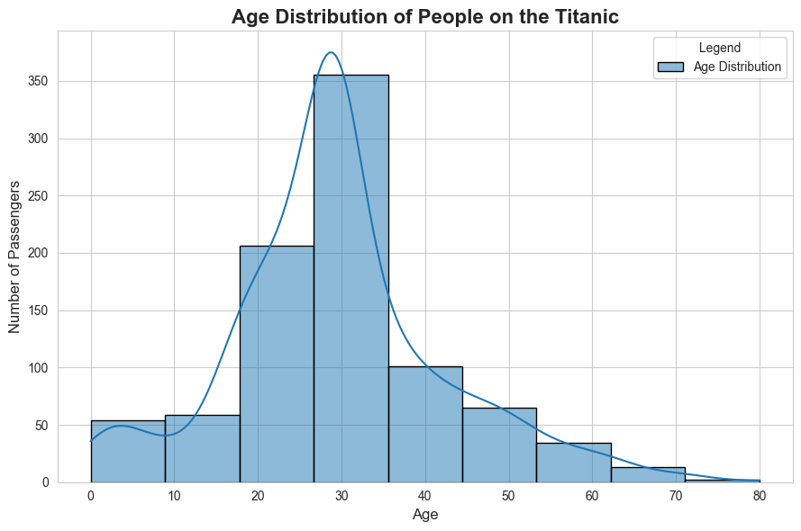
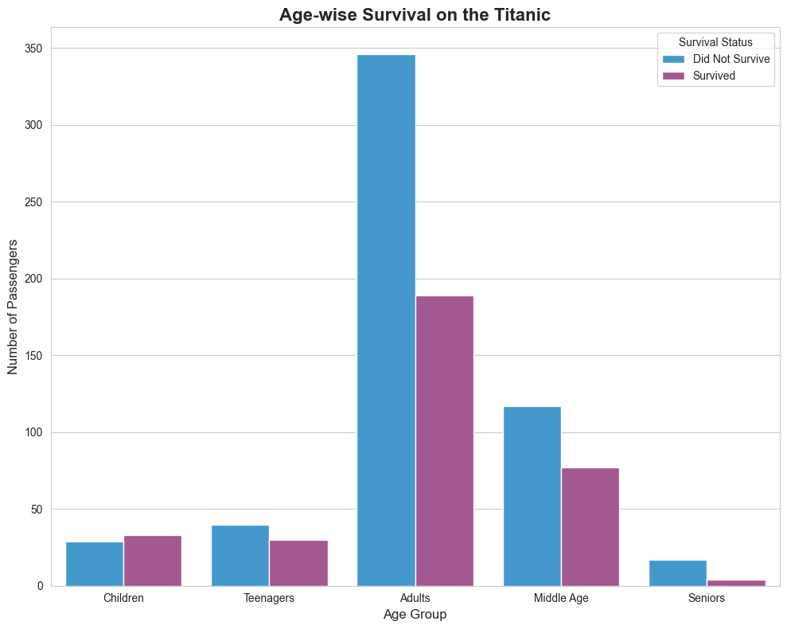
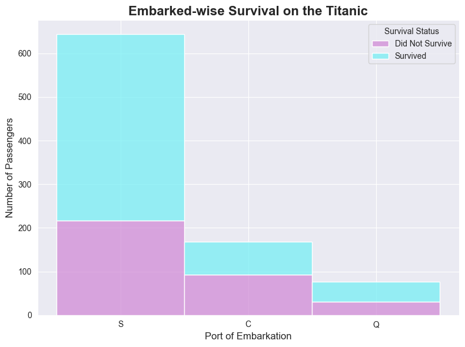
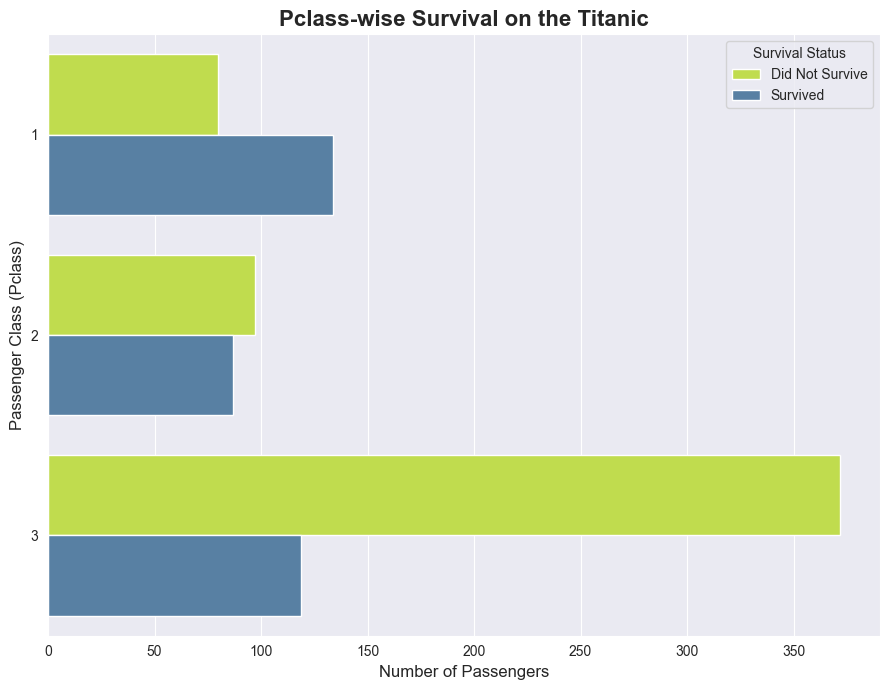
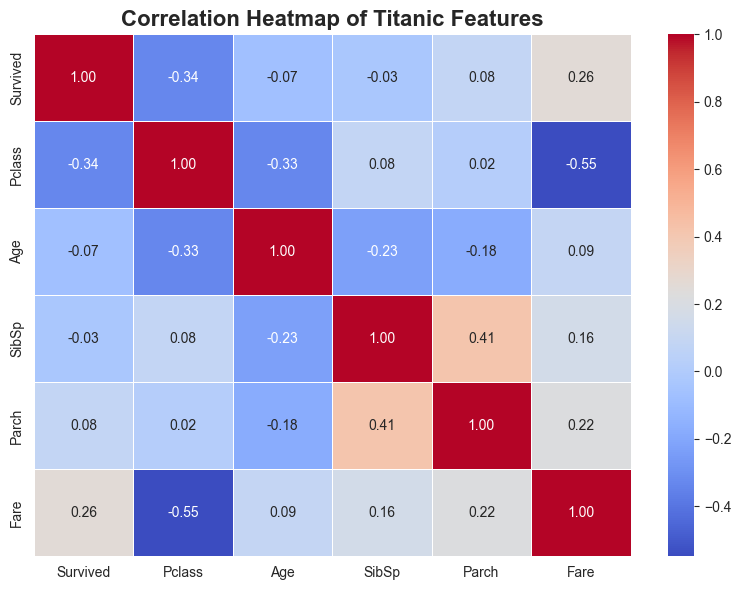
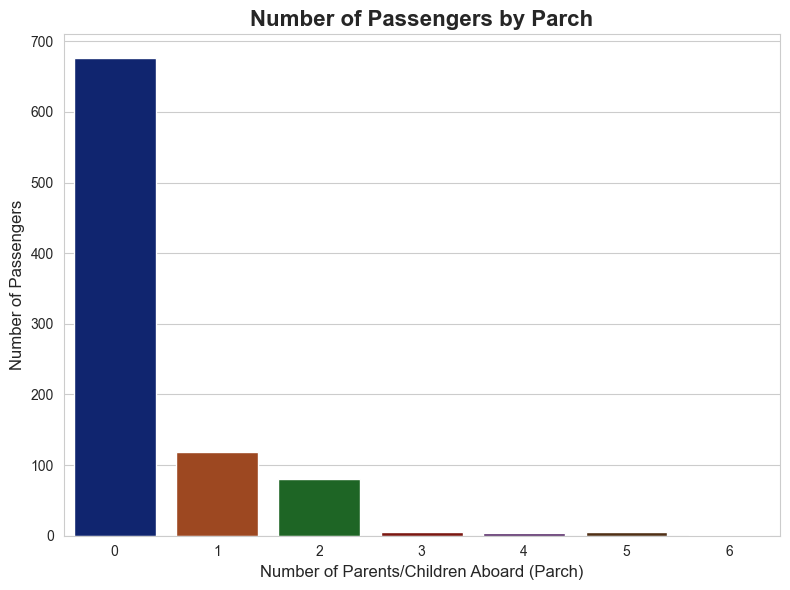

# Titanic Survival Analysis 🚢

## 📌 Project Overview

This project presents a **comprehensive exploratory data analysis (EDA)** of the Titanic dataset to understand the factors that influenced passenger survival. The analysis is performed entirely in a Jupyter Notebook using Python and focuses on **data cleaning, visualization, and insight extraction**.

The notebook contains **10 well-structured charts**, each answering a specific analytical question about survival patterns. This project is designed to be **portfolio-ready** and suitable for academic or professional presentation on GitHub.

---

## 📂 Project Structure

```
├── PR.Final.ipynb        # Main Jupyter Notebook (full analysis & 10 charts)
├── Titanic.csv           # Dataset
├── images/               # Folder containing exported chart images
│   ├── chart_01.png
│   ├── chart_02.png
│   ├── ...
│   └── chart_10.png
├── README.md             # Project documentation
```

---

## 📊 Visual Analysis (10 Charts)

The notebook includes **10 data visualizations** that explore survival from multiple perspectives. Below is the recommended way to display them in GitHub.

> 📌 **Important:** Export your charts from the notebook and save them inside the `images/` folder using the filenames below (or adjust names accordingly).

### 1️⃣ Survival Rate by Gender


**Insight:** Female passengers had a significantly higher survival rate than males.

---

### 2️⃣ Survival Rate by Passenger Class


**Insight:** First-class passengers had the highest survival probability.

---

### 3️⃣ Age Distribution of Passengers


**Insight:** The majority of passengers were young adults.

---

### 4️⃣ Survival by Age Group


**Insight:** Children had higher survival rates compared to adults.

---

### 5️⃣ Survival by Embarkation Port


**Insight:** Passengers embarking from certain ports showed different survival patterns.

---

### 6️⃣ Fare Distribution


**Insight:** Higher ticket fares were associated with better survival chances.

---

### 7️⃣ Survival vs Fare


**Insight:** Survivors generally paid higher fares than non-survivors.

---

### 8️⃣ Family Size Distribution


**Insight:** Passengers traveling alone had lower survival rates.

---

### 9️⃣ Survival by Family Size


**Insight:** Small families had higher survival probabilities than large families.

---

### 🔟 Correlation Heatmap


**Insight:** Gender, class, and fare show strong correlation with survival.

---

## 🛠️ Technologies Used

* **Python 3**
* **Jupyter Notebook**
* **Pandas** – data preprocessing and analysis
* **Matplotlib & Seaborn** – data visualization
* **NumPy** – numerical computation

---

## ▶️ How to Run the Project

1. Clone the repository:

   ```bash
   https://github.com/jobanputra-R/Python-Final-Project
   ```
2. Navigate to the project directory:

   ```bash
   cd titanic-survival-analysis
   ```
3. Install required libraries:

   ```bash
   pip install pandas matplotlib seaborn numpy
   ```
4. Open the notebook:

   ```bash
   jupyter notebook PR.Final.ipynb
   ```

---
